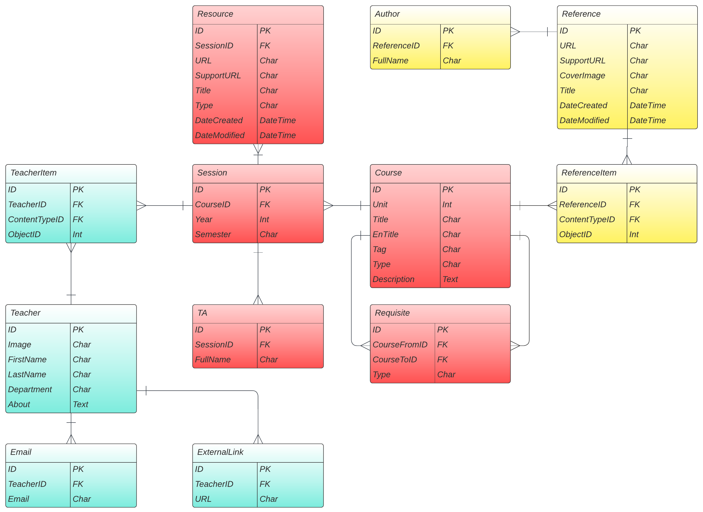

# CSE Archive RESTful API

*CSE Archive is an independent organization from Shiraz University CSE Department, and it is developed and maintained by its students.*

This is the source code of our API backend implemented in Django framework, which is opened for educational purposes and contributions.  
You can find a running instance of the project based on our official database in About section.

## Installation

CSE Archive API project uses **pipenv** to set up its virtual environment. If you don't have it already, install it first

```bash
pip install pipenv
```

At project root, use pipenv *install* command to install project dependencies listed in [Pipfile](https://github.com/CSE-Archive/RESTful-API/blob/main/Pipfile). After that, use its *shell* command to enable installed virtual environment

```bash
pipenv install
pipenv shell
```

Now you can start an instance of API on your local machine

```bash
python manage.py runserver
```

* By default at `localhost:8000`, and its admin site at the same address followed by `/admin` endpoint.  

Also to run **Performance Tests** you may use this command

```bash
locust -f locustfiles/main.py 
```

And to run **Unit Tests**,

```
pytest
```

## Sample Data

Use the following command to load the sample data.

```bash
python manage.py loaddata fixtures/admin_interface_theme_uswds.json fixtures/courses.json fixtures/requisities.json fixtures/chartnodes.json fixtures/professors.json fixtures/tas.json fixtures/classrooms.json fixtures/references.json fixtures/resources.json fixtures/recordings.json
```

## Database Design

The database used underneath this API contains tables specified in the following ER diagram. (It is divided into three separate django apps, each app marked with a different color)



## Endpoints

Currently with this implementation, database is read-only and just GET methods are needed and available, other operations like POST a new resource are limited to admins in admin site.  
Available endpoints and their overview in details can be found in [endpoints documentation]().

## Contribution

We are at the start of our way and definitely contributions of any size are helpful and appreciable.  
As you may know, you can contribute to this project by

1. [Fork](https://github.com/CSE-Archive/RESTful-API/fork) it!
2. Make your changes in a new branch
3. And [create a pull request](https://github.com/CSE-Archive/RESTful-API/compare) along with changes explanation.

Or if you have any enhancement idea but doesn't feel like to do it yourself, you can always [open a new issue](https://github.com/CSE-Archive/RESTful-API/issues/new?labels=enhancement) for that.

## Support

At this time project is completely set up on free and limited services and may have some downtimes or slow responses in future. You can always help us improve the project performance by supporting it through following platforms.

[](https://raw.githubusercontent.com/CSE-Archive/RESTful-API/main/docs/readmefiles/btc_address.txt) &nbsp;
[](https://idpay.ir/cse-archive)
